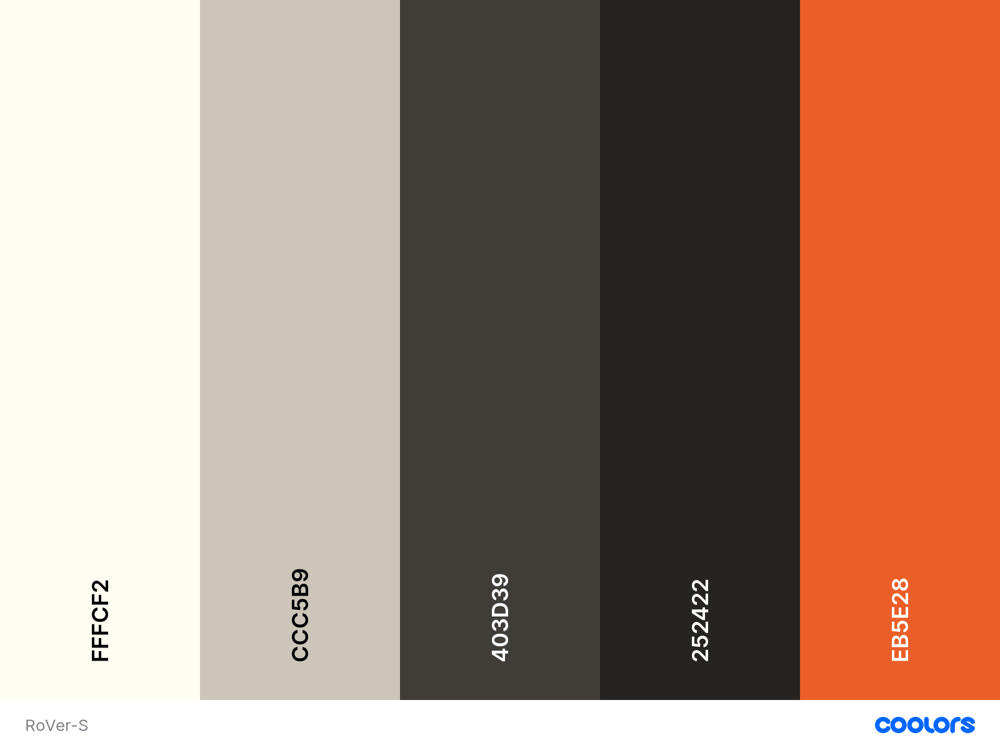

# The Long, Long Lunchbreak

### Design collaboration files for a mobile tiny home on wheels (MTHOW)

[Asana](https://app.asana.com/0/1199152416742837/list)

## Shapr 3D

/path/to/shapr3d/spec

## HAL 9000

--Potential link to personal iOS app for monitoring water/electricity consumption here--
Maybe something to sell later on to other MTHOW enthusiasts.

## Inspiration Links

### Elevator bed

- Motorized, suspended with pulleys and tracks: https://www.youtube.com/watch?v=ZEurdaURavw
- Manual, suspended pully arms and no tracks (must be supported): https://www.youtube.com/watch?v=1ppIrFl3KeY

## Color Palettes

#### Color aesthetic inspiration

⭐️⭐️⭐️ Jeff's Favorite ⭐️⭐️⭐️

### RoVer-S

### RoVer

### Swamp Logged X-Wing (a more distilled, pastel take on RoVer)

### Imperatrix

Brutally imposing, contemporary; red could be used sparingly for profound effect

### John Yossarian

Rugged; boldly defiant in the face of hypocrisy but fundamentally good; probably an all-in color scheme

### Sublueminal

A subtler take on Imperatrix

## Some left field ones...

### Solar Flare

### Never Winter

